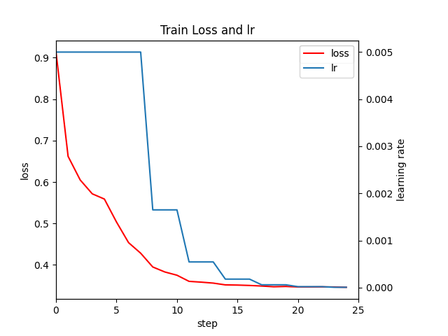
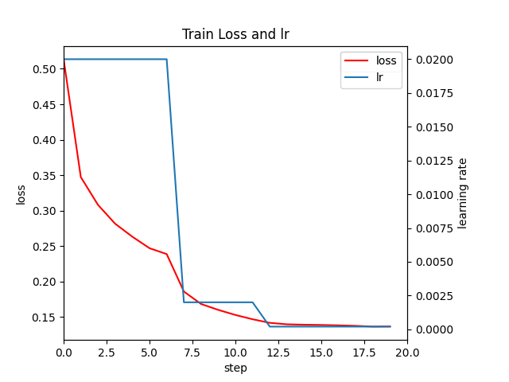
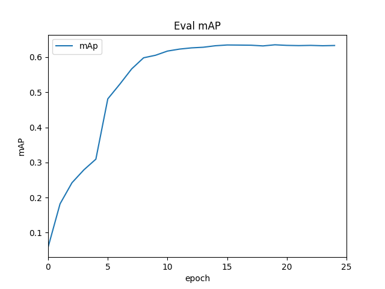
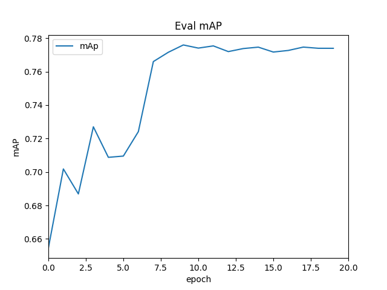

# Faster R-CNN Jittor

> 在这里我提供两个关于faster rcnn的项目，一个是结构更简单的版本(faster-rcnn-jittor)，一个是更加模块化，结构更清晰的版本(faster-rcnn-pytorch_to_jittor)。不过后者我并没有完成地完成转换，所以放在这里是为了更好的了解faster rcnn项目的结构框架。

## 环境配置：

~~~
python：3.10
Jittor：1.3.9
g++:7.5.0
Ubuntu(Linux-5.15.0)
GPU：推荐RTX30系的显卡，和jittor更加的兼容，RTX40系的会出现兼容警告
pycocotools(Linux:pip install pycocotools; Windows:pip install pycocotools-windows(不需要额外安装vs))
mpicc（多卡训练）：sudo apt install openmpi-bin openmpi-common libopenmpi-dev
~~~

详细环境配置见`requirements.txt`

注意：在Jittor中，分布式基于MPI（Message Passing Interface）进行多卡和分布式训练，官方说的是目前计图处于测试阶段。

计图会自动检测环境变量中是否包含`mpicc`，如果计图成功的检测到了`mpicc`，那么会输出如下信息：

```
[i 0502 14:09:55.758481 24 __init__.py:203] Found mpicc(1.10.2) at /usr/bin/mpicc
```

如果计图没有在环境变量中找到mpi，用户也可以手动指定mpicc的路径告诉计图，添加环境变量即可：`export mpicc_path=/you/mpicc/path`

`OpenMPI`安装完成以后，用户无需修改代码，需要做的仅仅是修改启动命令行，计图就会用数据并行的方式自动完成并行操作。

```
# 单卡训练代码
python3.7 -m jittor.test.test_resnet
# 分布式多卡训练代码
mpirun -np 4 python3.7 -m jittor.test.test_resnet
# 指定特定显卡的多卡训练代码
CUDA_VISIBLE_DEVICES="2,3" mpirun -np 2 python3.7 -m jittor.test.test_resnet
```

但是如果你以root的身份使用mpicc，可能会出现如下报错：

~~~
mpirun has detected an attempt to run as root.
Running at root is *strongly* discouraged as any mistake (e.g., in
defining TMPDIR) or bug can result in catastrophic damage to the OS
file system, leaving your system in an unusable state.

You can override this protection by adding the --allow-run-as-root
option to your cmd line. However, we reiterate our strong advice
against doing so - please do so at your own risk.
~~~

因此可以利用下面这条语句运行（但是官方给出的建议是不推荐，但是由于这个是一个虚拟环境，而且这种方式最便捷，所以我就用了）

```
mpirun --allow-run-as-root -np N_GPU python train.py
```

## 文件结构：

~~~
  ├── log:存放日志
  ├── model_data:pascal_voc标签文件
  ├── nets:Faster R-CNN网络（包括Fast R-CNN以及RPN等模块）
  ├── utils:工具文件，用于存放例如anchor生成类，数据加载类等
  ├── VOCdevkit:数据存放文件夹
  ├── predict.py：预测文件
  ├── train.py：训练文件
  ├── voc_annotation.py：生成有关数据集的标注
~~~

## 预训练权重下载地址

我们需要的权重包括`voc_weights_resnet.pth`或者`voc_weights_vgg.pth`以及主干的网络权重我已经上传了百度云，可以自行下载。

顺便训练好的参数我也一并放入了文件夹：

- https://pan.baidu.com/s/1VIDE5Qx8vN-2_EsuVPsMUw?pwd=8888 

## 数据集的下载

`VOC`数据集下载地址如下，里面已经包括了训练集、测试集、验证集（与测试集一样），无需再次划分：

该数据集为`VOC07+12`的数据集，包括了训练与测试用的数据集。为了训练方便，该数据集中`val.txt`与`test.txt`相同。

通过网盘分享的文件：VOC07+12+test.zip

- https://pan.baidu.com/s/1rOrlbVQio5p7JytKZcFdXw?pwd=8888 

  如果不了解数据集或者想使用自己的数据集进行训练，请参考此视频：https://b23.tv/F1kSCK


## 模型训练

### 训练VOC07+12数据集

#### 1.数据集的准备

本文使用`VOC`格式进行训练，训练前需要下载好`VOC07+12`的数据集，解压后放在根目录会自动填到`VOCdevkit`文件下面。

#### 2.数据集的处理

修改`voc_annotation.py`里面的`annotation_mode = 2`，运行`voc_annotation.py`生成根目录下的`2007_train.txt`和`2007_val.txt`。

#### 3.开始网络训练

`train.py`的默认参数用于训练`VOC`数据集，直接运行`train.py`即可开始训练。backbone我选择的是vgg.

#### 4.预测

训练结果预测需要用到两个文件，分别是`frcnn.py`和`predict.py`。

我们首先需要去`frcnn.py`里面修改model_path以及classes_path，这两个参数必须要修改。

model_path指向训练好的权值文件，在logs文件夹里。

classes_path指向检测类别所对应的txt。

完成修改后就可以运行`predict.py`进行检测了。运行后输入图片路径即可检测。


# 结果

## loss & lr

jittor:



pytorch：



## mAP：

jittor：



pytorch：




## log

jittor:

~~~
epoch:0 0.0163  0.0537  0.0049  0.0000  0.0032  0.0218  0.0278  0.0456  0.0460  0.0000  0.0042  0.0612  0.9143  0.005000
epoch:1 0.0568  0.1739  0.0186  0.0000  0.0098  0.0780  0.0991  0.1604  0.1621  0.0008  0.0370  0.2120  0.6671  0.005000
epoch:2 0.0920  0.2595  0.0363  0.0002  0.0195  0.1254  0.1480  0.2300  0.2328  0.0026  0.0670  0.3042  0.6025  0.005000
epoch:3 0.0954  0.2767  0.0342  0.0013  0.0322  0.1300  0.1548  0.2524  0.2589  0.0119  0.1014  0.3278  0.5745  0.005000
epoch:4 0.1188  0.3203  0.0531  0.0004  0.0407  0.1621  0.1814  0.2809  0.2872  0.0102  0.1289  0.3576  0.5603  0.005000
epoch:5 0.2025  0.4770  0.1325  0.0110  0.0982  0.2518  0.2526  0.3608  0.3677  0.0412  0.2163  0.4391  0.5065  0.005000
epoch:6 0.2417  0.5374  0.1704  0.0256  0.1315  0.2925  0.2811  0.3879  0.3940  0.0797  0.2386  0.4639  0.4547  0.005000
epoch:7 0.2593  0.5692  0.1898  0.0306  0.1512  0.3134  0.2881  0.3987  0.4058  0.0776  0.2643  0.4758  0.4259  0.005000
epoch:8 0.2897  0.6000  0.2376  0.0371  0.1724  0.3469  0.3104  0.4258  0.4354  0.1049  0.2970  0.5028  0.3931  0.001650
epoch:9 0.2953  0.6065  0.2461  0.0336  0.1734  0.3527  0.3138  0.4379  0.4489  0.1092  0.3078  0.5159  0.3828  0.001650
epoch:10 0.3028  0.6151  0.2558  0.0384  0.1840  0.3609  0.3178  0.4410  0.4507  0.1152  0.3127  0.5182  0.3743  0.001650
epoch:11 0.3146  0.6282  0.2792  0.0384  0.1908  0.3744  0.3255  0.4453  0.4538  0.1059  0.3151  0.5210  0.3628  0.000545
epoch:12 0.3174  0.6282  0.2826  0.0406  0.1900  0.3787  0.3274  0.4482  0.4560  0.1179  0.3109  0.5254  0.3599  0.000545
epoch:13 0.3178  0.6316  0.2798  0.0366  0.1925  0.3793  0.3292  0.4509  0.4600  0.1073  0.3158  0.5308  0.3565  0.000545
epoch:14 0.3209  0.6335  0.2880  0.0404  0.1962  0.3819  0.3297  0.4531  0.4613  0.1139  0.3161  0.5320  0.3525  0.000180
epoch:15 0.3219  0.6356  0.2939  0.0402  0.1934  0.3832  0.3299  0.4504  0.4583  0.1190  0.3154  0.5276  0.3509  0.000180
epoch:16 0.3215  0.6332  0.2898  0.0430  0.1971  0.3816  0.3301  0.4523  0.4612  0.1145  0.3179  0.5298  0.3503  0.000180
epoch:17 0.3239  0.6376  0.2966  0.0452  0.1974  0.3849  0.3323  0.4539  0.4616  0.1147  0.3160  0.5309  0.3495  0.000059
epoch:18 0.3247  0.6362  0.2960  0.0428  0.1975  0.3858  0.3338  0.4535  0.4620  0.1149  0.3183  0.5314  0.3479  0.000059
epoch:19 0.3212  0.6337  0.2891  0.0434  0.1965  0.3820  0.3309  0.4514  0.4596  0.1157  0.3161  0.5280  0.3479  0.000059
epoch:20 0.3221  0.6372  0.2897  0.0412  0.1961  0.3830  0.3313  0.4525  0.4606  0.1213  0.3150  0.5302  0.3478  0.000020
epoch:21 0.3232  0.6352  0.2960  0.0431  0.1973  0.3834  0.3321  0.4527  0.4608  0.1164  0.3149  0.5299  0.3490  0.000020
epoch:22 0.3244  0.6365  0.2947  0.0441  0.1983  0.3852  0.3325  0.4553  0.4637  0.1223  0.3196  0.5331  0.3476  0.000020
epoch:23 0.3232  0.6367  0.2896  0.0415  0.1983  0.3832  0.3322  0.4532  0.4612  0.1197  0.3200  0.5293  0.3468  0.000006
epoch:24 0.3243  0.6368  0.2944  0.0416  0.1989  0.3855  0.3327  0.4527  0.4614  0.1247  0.3185  0.5310  0.3467  0.000006

~~~

pytorch:

~~~
epoch:0 0.3079  0.6546  0.2426  0.1441  0.2570  0.3339  0.3154  0.4644  0.4736  0.2467  0.3926  0.5020  0.5135  0.020000
epoch:1 0.3986  0.7018  0.4101  0.1738  0.3186  0.4348  0.3812  0.5586  0.5706  0.3147  0.4916  0.6011  0.3474  0.020000
epoch:2 0.3879  0.6869  0.4031  0.1543  0.3095  0.4259  0.3706  0.5474  0.5588  0.3273  0.4861  0.5855  0.3082  0.020000
epoch:3 0.4094  0.7270  0.4242  0.1740  0.3269  0.4471  0.3809  0.5607  0.5704  0.3435  0.4906  0.6031  0.2816  0.020000
epoch:4 0.4070  0.7088  0.4281  0.1745  0.3060  0.4550  0.3831  0.5544  0.5629  0.2878  0.4794  0.6005  0.2633  0.020000
epoch:5 0.4132  0.7095  0.4344  0.1476  0.3058  0.4636  0.3885  0.5623  0.5687  0.3354  0.4808  0.6080  0.2471  0.020000
epoch:6 0.4293  0.7241  0.4573  0.1847  0.3129  0.4783  0.3967  0.5738  0.5812  0.3021  0.4801  0.6228  0.2388  0.020000
epoch:7 0.4896  0.7660  0.5412  0.2068  0.3627  0.5430  0.4330  0.6128  0.6198  0.3105  0.5097  0.6668  0.1860  0.002000
epoch:8 0.4933  0.7716  0.5473  0.2248  0.3668  0.5478  0.4347  0.6099  0.6160  0.3200  0.5011  0.6659  0.1684  0.002000
epoch:9 0.5019  0.7760  0.5553  0.2116  0.3731  0.5569  0.4396  0.6169  0.6228  0.3025  0.5073  0.6734  0.1601  0.002000
epoch:10 0.5009  0.7741  0.5561  0.2202  0.3734  0.5564  0.4391  0.6141  0.6191  0.3072  0.4989  0.6702  0.1529  0.002000
epoch:11 0.5025  0.7754  0.5551  0.2158  0.3705  0.5589  0.4402  0.6101  0.6152  0.3051  0.4869  0.6676  0.1469  0.002000
epoch:12 0.5000  0.7720  0.5547  0.2152  0.3682  0.5564  0.4387  0.6076  0.6124  0.2992  0.4836  0.6661  0.1418  0.000200
epoch:13 0.5015  0.7738  0.5521  0.2146  0.3723  0.5580  0.4403  0.6092  0.6141  0.3022  0.4889  0.6677  0.1398  0.000200
epoch:14 0.5028  0.7746  0.5571  0.2136  0.3709  0.5603  0.4398  0.6097  0.6147  0.2973  0.4898  0.6679  0.1392  0.000200
epoch:15 0.4984  0.7717  0.5480  0.2135  0.3653  0.5554  0.4371  0.6035  0.6080  0.3014  0.4724  0.6624  0.1388  0.000200
epoch:16 0.4998  0.7727  0.5502  0.2090  0.3698  0.5575  0.4385  0.6070  0.6119  0.2993  0.4869  0.6656  0.1383  0.000200
epoch:17 0.5037  0.7747  0.5601  0.2116  0.3714  0.5613  0.4418  0.6090  0.6137  0.2948  0.4876  0.6676  0.1376  0.000200
epoch:18 0.5015  0.7740  0.5561  0.2133  0.3707  0.5589  0.4403  0.6087  0.6134  0.2995  0.4833  0.6679  0.1365  0.000200
epoch:19 0.5025  0.7740  0.5557  0.2138  0.3707  0.5601  0.4407  0.6084  0.6131  0.3005  0.4849  0.6672  0.1367  0.000200

~~~

jittor：

~~~
COCO results:
 Average Precision  (AP) @[ IoU=0.50:0.95 | area=   all | maxDets=100 ] = 0.324
 Average Precision  (AP) @[ IoU=0.50      | area=   all | maxDets=100 ] = 0.637
 Average Precision  (AP) @[ IoU=0.75      | area=   all | maxDets=100 ] = 0.294
 Average Precision  (AP) @[ IoU=0.50:0.95 | area= small | maxDets=100 ] = 0.042
 Average Precision  (AP) @[ IoU=0.50:0.95 | area=medium | maxDets=100 ] = 0.199
 Average Precision  (AP) @[ IoU=0.50:0.95 | area= large | maxDets=100 ] = 0.386
 Average Recall     (AR) @[ IoU=0.50:0.95 | area=   all | maxDets=  1 ] = 0.333
 Average Recall     (AR) @[ IoU=0.50:0.95 | area=   all | maxDets= 10 ] = 0.453
 Average Recall     (AR) @[ IoU=0.50:0.95 | area=   all | maxDets=100 ] = 0.461
 Average Recall     (AR) @[ IoU=0.50:0.95 | area= small | maxDets=100 ] = 0.125
 Average Recall     (AR) @[ IoU=0.50:0.95 | area=medium | maxDets=100 ] = 0.319
 Average Recall     (AR) @[ IoU=0.50:0.95 | area= large | maxDets=100 ] = 0.531

mAP(IoU=0.5) for each category:
 aeroplane      : 0.778783429199752
 bicycle        : 0.7402034768643639
 bird           : 0.6677529775962066
 boat           : 0.42477422311288004
 bottle         : 0.3713819776676335
 bus            : 0.753563397362123
 car            : 0.6355457061681201
 cat            : 0.8431385495020621
 chair          : 0.4346073228698847
 cow            : 0.614887481767308
 diningtable    : 0.4646612781961273
 dog            : 0.8282480474872658
 horse          : 0.7361739265121747
 motorbike      : 0.7772930297123379
 person         : 0.7716061853317537
 pottedplant    : 0.32037824576787627
 sheep          : 0.6841340145637693
 sofa           : 0.5592354962459992
 train          : 0.7262911441639058
 tvmonitor      : 0.6040519888083591
~~~

pytorch

~~~
COCO results:
 Average Precision  (AP) @[ IoU=0.50:0.95 | area=   all | maxDets=100 ] = 0.503
 Average Precision  (AP) @[ IoU=0.50      | area=   all | maxDets=100 ] = 0.774
 Average Precision  (AP) @[ IoU=0.75      | area=   all | maxDets=100 ] = 0.556
 Average Precision  (AP) @[ IoU=0.50:0.95 | area= small | maxDets=100 ] = 0.214
 Average Precision  (AP) @[ IoU=0.50:0.95 | area=medium | maxDets=100 ] = 0.371
 Average Precision  (AP) @[ IoU=0.50:0.95 | area= large | maxDets=100 ] = 0.560
 Average Recall     (AR) @[ IoU=0.50:0.95 | area=   all | maxDets=  1 ] = 0.441
 Average Recall     (AR) @[ IoU=0.50:0.95 | area=   all | maxDets= 10 ] = 0.608
 Average Recall     (AR) @[ IoU=0.50:0.95 | area=   all | maxDets=100 ] = 0.613
 Average Recall     (AR) @[ IoU=0.50:0.95 | area= small | maxDets=100 ] = 0.300
 Average Recall     (AR) @[ IoU=0.50:0.95 | area=medium | maxDets=100 ] = 0.485
 Average Recall     (AR) @[ IoU=0.50:0.95 | area= large | maxDets=100 ] = 0.667

mAP(IoU=0.5) for each category:
 aeroplane      : 0.8628805949309599
 bicycle        : 0.827798696869338
 bird           : 0.7563023169147771
 boat           : 0.6224587173396154
 bottle         : 0.6857296037575242
 bus            : 0.8539958011749678
 car            : 0.8638060400419525
 cat            : 0.891868562923814
 chair          : 0.598443790105411
 cow            : 0.805838720281636
 diningtable    : 0.6093489805272293
 dog            : 0.8456126594621742
 horse          : 0.8375265916243826
 motorbike      : 0.8557924877231698
 person         : 0.8912308128837677
 pottedplant    : 0.5386039120528918
 sheep          : 0.8154008496387473
 sofa           : 0.7103473985546446
 train          : 0.8468162016874846
 tvmonitor      : 0.7594149108772177
~~~


